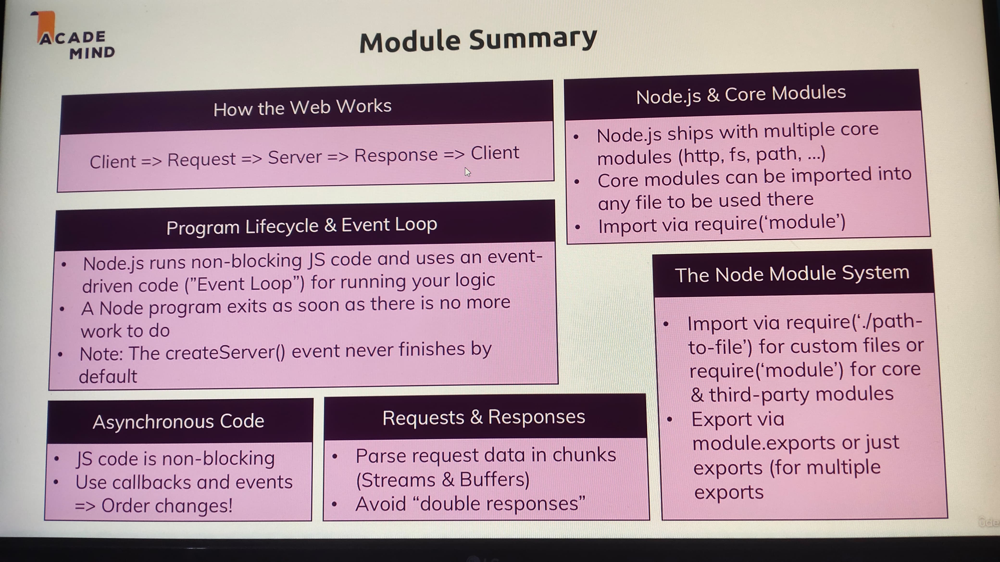

# Node.js

## Introduction

Node.js is an open-source, cross-platform JavaScript runtime environment that allows us to run JavaScript outside the browser.

Node.js is built on the V8 engine, which is developed in C++. The V8 engine is used to run JavaScript in the browser (e.g., Chrome).
Here’s an improved version of your note with clearer explanations and formatting:

---

## Creating a Server in Node.js

To set up a server in Node.js, we first need to import the built-in 'http' module.

### Importing Modules

In Node.js, we use the `require` keyword to load modules or files into our project.

By assigning the module/file to a variable or constant, we can easily reference it without needing to import it multiple times.

- **Importing a Local File:** To import a local file, use the relative path.

  ```js
  const fileName = require("./file-name");
  ```

- **Importing a Global Module:** To import a built-in or installed module, simply use its name.
  ```js
  const http = require("http");
  ```

**Tip:** It’s a good practice to name your variable after the module/file you're importing, especially in Node.js.

### `createServer()`

The `createServer()` method is used to create a server. It accepts a **requestListener** function, which handles incoming requests.

- **requestListener:** A function that runs each time a request is made to the server. It takes two arguments:
  - **Incoming Request (`req`):** This is an object provided by Node.js that contains details about the incoming request (e.g., headers, URL).
  - **Server Response (`res`):** This is an object used to send a response back to the client.

**Note:** The order of these arguments is important—`req` (request) comes first, followed by `res` (response). You can name them however you like, but their order must stay the same.

#### Example:

```js
function rqListener(req, res) {
  console.log(req); // Logs details of the incoming request
}

const server = http.createServer(rqListener); // Creates the server
```

### `listen()`

The `listen()` method instructs Node.js to keep the process running and listen for incoming requests.

It accepts several optional arguments:

- **Port:** The port number your server will listen on (e.g., 8080, 3000). If not provided, it defaults to 80.
- **Hostname:** The server hostname, defaulting to the local machine (localhost).
- **Backlog:** Defines the maximum number of queued pending connections (optional).
- **Listening Listener:** A callback function that runs once the server starts listening (optional).

#### Example:

```js
server.listen(3000, "localhost", () => {
  console.log("Server is running on http://localhost:3000");
});
```

---

Here's an improved version of your note with added explanation and corrected spelling/grammar:

---

## Node.js Program Lifecycle

### Overview of the Node.js Lifecycle:

1. **Start Script:** When you run a Node.js program using `node app.js`, it initiates the script.
2. **Parsing and Registering:** Node.js parses the code and registers variables, functions, and event listeners.
3. **Event Loop:** After parsing, the event loop starts running. It continues running as long as there are registered event listeners.
4. **Process Exit:** Once no more events or listeners are left to handle, the application exits using `process.exit()`.

### Image digram of node lifecycle:


**Diagram Explanation:**  
The lifecycle starts with parsing the code and registering event listeners. The application will continue running as long as there are event listeners, which are managed by the event loop. Once all listeners are handled, the `process.exit()` is triggered to end the Node.js process.

---

### Event Loop

The event loop is the core mechanism that keeps a Node.js application running. It continuously monitors and processes events, such as incoming requests or timers, as long as there are event listeners registered.

- The event loop ensures that asynchronous tasks can be handled without blocking the main thread.
- When the event loop has no further tasks to execute, the Node.js application ends.

To manually exit the event loop and stop the application, you can use the `process.exit()` method, which terminates the program.

---

## Understanding the Response:

In the incoming request data (which is an object), we can extract useful information like the **URL**, **method**, and **headers**.

Let's assume the incoming request is represented by the argument `req`.

- **URL:** You can get the URL of the request using `req.url`.
- **Method:** You can find out which HTTP method was used for the request (like GET, POST, PUT, etc.) with `req.method`.
- **Headers:** You can access all the headers set in the request using `req.headers`.

**Example:**

```js
console.log("URL:", req.url);
console.log("\nMethod: ", req.method);
console.log("\nHeaders: ", req.headers);
```

---

## Sending a Response:

We use the response object (`res`) to send data back to the user.

Some common methods for sending data are:

- **Set Header:** Use `res.setHeader()` to set the headers of the response (e.g., content type).
- **Send Data:** To send data, use `res.write()`. This method allows us to send data like text or HTML.
- **End Response:** To indicate that the response is finished, use `res.end()`. After calling `res.end()`, any further attempt to use `res.write()` will result in an error.

**Example:**

```js
res.setHeader("Content-Type", "text/html");
res.write("<html>");
res.write("<head><title>My First Page</title></head>");
res.write("<body><h1>Hello from my Node.js Server!</h1></body>");
res.write("</html>");
res.end();
```

**Note:** To learn more about headers, visit [MDN - HTTP Headers](https://developer.mozilla.org/en-US/docs/Web/HTTP/Headers).

---

## Routing Request

Routing refers to the process of handling different requests based on the URL and HTTP method. In Node.js, we can implement routing by checking the URL and responding accordingly.

### Routes:

`route` is the part of the URL that comes after the base URL and helps the server determine which page or functionality to load. It directs the server on how to respond to specific requests based on the path provided.

For example, in `http://example.com/home`, `/home` is the route that tells the server to load the homepage content.

### How Routing Works:

1. **Capture the URL:** The request object (`req`) contains the URL of the incoming request, which we can access using `req.url`.
2. **Conditional Routing:** We use conditional statements (like `if-else` or `switch`) to check the URL and define what response should be sent based on the route.
3. **Example Code for Routing:**

```js
const url = req.url;

if (url === "/") {
  // Route for the home page ('/')
  res.write("<html>");
  res.write("<head><title>My First Page</title></head>");
  res.write("<body>");
  res.write('<form action="/message" method="POST">');
  res.write('<input type="text" name="message">');
  res.write('<button type="submit">Send</button>');
  res.write("</form>");
  res.write("</body>");
  res.write("</html>");
  return res.end(); // Stop execution after handling '/'
}

// Default response if no specific route is matched
res.setHeader("Content-Type", "text/html");
res.write("<html>");
res.write("<head><title>My First Page</title></head>");
res.write("<body><h1>Hello from my Node.js Server!</h1></body>");
res.write("</html>");
res.end();
```

### Explanation:

1. **Home Route (`/`):**

   - If the request URL is `'/'`, the server responds with an HTML form that allows the user to submit a message via POST to the `/message` route.
   - The `return res.end();` ensures that the response ends after sending the HTML for the home route.

2. **Default Response:**
   - For all other URLs, a default response is sent, which includes a simple HTML page with a greeting message.

### Key Points:

- **Routing Logic:** We manually check the `req.url` to determine the route.
- **Form Submission:** The form sends a POST request to the `/message` route, where we could handle the message in future steps.
- **Ending the Response:** Always ensure the response is ended with `res.end()` after sending the desired content.

---

Here’s an improved and corrected version of your note:

---

## Redirecting Requests

Redirecting is the process of sending a user from one page to another based on URL routes.

To perform a redirect, we need to specify the status code for redirection and the location where the user will be redirected.

- **Redirecting Status Code:** To redirect, the status code should be set to `302`, which tells the browser that we want to redirect the user to another page.  
  **Example:** `res.statusCode = 302;`

- **Redirection Location:** To specify the destination of the redirection, we use the `setHeader` method. It takes two arguments: the first is the string `'Location'`, and the second is the route where you want to redirect.  
  **Example:** `res.setHeader('Location', '/');`

### File System Module

The file system module (`fs`) allows us to perform operations like reading, writing, and manipulating files.

- **writeFileSync():** This method helps us create or overwrite a file. It takes three arguments: `file`, `data`, and an optional `options` argument.
  - **file:** The name of the file to create or write to (as a string).
  - **data:** The data to be written into the file.
  - **options:** An optional argument for specifying encoding, mode, flags, etc. It is a callback argument which will be excuted after the file is created.

### Example Code

```js
const url = req.url;
const method = req.method;

if (url === "/") {
  res.write("<html>");
  res.write("<head><title>My First Page</title></head>");
  res.write(
    '<body><form action="/message" method="POST"><input type="text" name="message"><button type="submit">Send</button></form></body>'
  );
  res.write("</html>");
  return res.end();
}

if (url === "/message" && method === "POST") {
  fs.writeFileSync("message.txt", "Dummy");
  res.statusCode = 302;
  res.setHeader("Location", "/");
  return res.end();
}

res.setHeader("Content-Type", "text/html");
res.write("<html>");
res.write("<head><title>My First Page</title></head>");
res.write("<body><h1>Hello from my Node.js Server</h1></body>");
res.write("</html>");
res.end();
```

### Explanation:

- The Node.js code checks the URL route.
  - If the route is `'/'`, it displays a form with an input box and a submit button.
  - If the route is `'/message'` and the method is `POST`, it creates a `message.txt` file with dummy content, sets the status code to `302`, and redirects the user to the home page (`'/'`).
  - If neither of these routes is matched, the server displays a message, "Hello from my Node.js Server."

---

## Parsing Request Bodies:

When handling incoming HTTP requests, especially those with POST data, we need to process the request body to extract the data. In Node.js, request bodies are streamed, and we use buffers to collect the data chunks for processing.

### Stream:

- `Stream` is a ongoing data.

- The **request body** in Node.js is sent in **streams** of data, which arrive in small chunks. This allows us to process data as it is received without waiting for the entire body to be sent.
- We listen for the `'data'` event on the `req` object to get each chunk of data.

### Buffers:

- Buffers are used to store raw binary data. When the chunks of data are received, we store them in an array and then concatenate them into a single buffer. Afterward, we convert the buffer into a string to process the data.

**Example:**

```js
const url = req.url;
const method = req.method;
if (url === "/") {
  res.write("<html>");
  res.write("<head>  <title> My first page </title> </head>");
  res.write(
    '<body> <form action="/message" method="POST"> <input type="text" name="message"> <button type="submit"> Send </button> </form> </body>'
  );
  res.write("</html>");
  return res.end();
}
if (url === "/message" && method === "POST") {
  const body = [];
  req.on("data", (chunk) => {
    console.log("Chunk", chunk); // Display each chunk of data
    body.push(chunk); // Add each chunk to the body array
  });
  req.on("end", () => {
    const parsedBody = Buffer.concat(body).toString(); // Concatenate and convert to string
    const message = parsedBody.split("=")[1]; // Extract message from the parsed body
    fs.writeFileSync("message.txt", message); // Write message to a file
  });
  res.statusCode = 302; // Redirect status code
  res.setHeader("Location", "/"); // Redirect back to home page
  return res.end();
}
res.setHeader("Content-Type", "text/html");
res.write("<html>");
res.write("<head>  <title> My first page </title> </head>");
res.write("<body> <h1> Hello from my Node.js Server </h1> </body>");
res.write("</html>");
res.end();
```

### Explanation:

- When a POST request is made to `/message`, the code listens for `'data'` events on the request. It pushes each chunk of data into the `body` array.
- Once the request is fully received (`'end'` event), the buffer is concatenated and converted to a string.
- The message value is extracted from the parsed data and saved in `message.txt`.
- Afterward, a redirect (302 status code) is issued back to the root (`/`).

---

## Blocking and Non-Blocking Code

### Blocking Code

Blocking code prevents further code execution until the current task is fully completed.

**Example:**

```js
fs.writeFileSync("Message.txt", message);
```

**Explanation:**  
The `writeFileSync` method blocks the execution of any subsequent code until the file is completely written.

### Non-Blocking Code

Non-blocking code allows the program to continue running other tasks while the current task is still in progress.

**Example:**

```js
fs.writeFile("Message.txt", message, (err) => {
  if (err) throw err;
  console.log("File has been saved.");
});
```

**Explanation:**  
The `writeFile` method is non-blocking, meaning it allows the execution of other code while the file is being written in the background. The callback function runs once the task is complete.

---

Here's a note explaining the behind-the-scenes of Node.js based on the image:

---

## Single Thread, Event Loop & Blocking Code

In Node.js, JavaScript runs in a **single thread**, meaning there is one main execution context. However, Node.js handles asynchronous operations using the **event loop** and **worker threads** to manage multiple tasks simultaneously without blocking code execution.

### How It Works:

1. **Incoming Requests**: Multiple client requests come into the server at the same time, but Node.js uses a single JavaScript thread to handle them.

2. **Single JavaScript Thread**: This thread handles all the incoming requests in an event-driven manner, processing each request based on what it requires.

3. **Event Loop**:

   - The event loop is a core part of Node.js, responsible for managing asynchronous callbacks and non-blocking operations.
   - When a blocking operation (like file system calls or network requests) is encountered, the event loop decides whether it should be handled immediately or passed on to other mechanisms, like the worker pool.

4. **Worker Pool (for Heavy Lifting)**:

   - Node.js offloads heavy or blocking tasks (like file system operations - marked as `fs` in the diagram) to a worker pool managed by the **libuv** library.
   - The worker pool operates on different threads to handle these tasks without blocking the main thread.
   - Once the task is completed, the worker pool returns the result to the event loop, which triggers the corresponding callback.

5. **Non-Blocking Code**:
   - Operations that do not require the thread to wait (like callbacks or timers) are handled by the event loop directly without pausing the execution of other code.
6. **Blocking Code**:
   - Some operations, like file system (`fs`) operations, are considered blocking if they stop the main thread from progressing.
   - These operations are sent to the worker pool to avoid blocking the single JavaScript thread.

### Diagram:

;
;

---

## Using The Node Modules System

### Exports
***Method 1:**
```js
  module.exports = requestHandler;
  ```

***Method 2:**
```js
  module.exports = {
    handler: reqHandler,
    someText: 'Dummy',
  };
  ```

***Method 3:**
```js
  module.exports.handler = reqHandler;
  module.exports.someText = 'Dummy';
  ```

***Method 4:**
```js
  exports.handler = reqHandler;
  exports.someText = 'Dummy';
  ```

***Method 5:**
```js
  module.exports = const requestHandler = () => {};
  ```

### Import

***Local Module:**
```js
  const requestHandler = require('./requestHandler');
  ```

***Global/node Module:**
```js
  const requestHandler = require('./requestHandler');
  ```
 

 --- 

 ## Summury

 